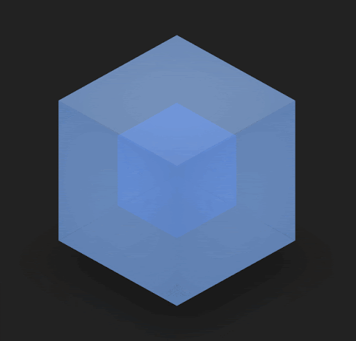
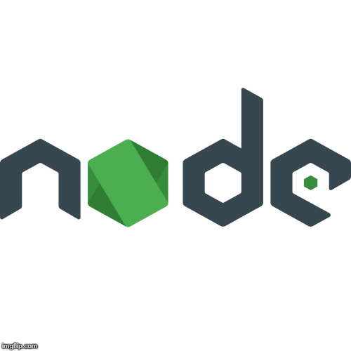

# Hello !!! , [I'm Ayush Khandelwal!](https://www.linkedin.com/in/ayush-khandelwal-741a88194/) &nbsp; &nbsp; 

## So. This is my profile🥱 💁‍♂️ &nbsp; &nbsp; &nbsp;

A sophomore  pursuing Bachelors in Information Technology 🎓 from Indian Institute of Information Technology Allahabad 🏛 who is an ardent learner, a passionate developer🖥️,competative coder💡 and a great admirer of nature in the quest to dig interesting algorithms and patterns inspired by nature🌿. Have a keen interest in the latest and upcoming technologies👨‍💻 , cyber security🕸️  and their impact in our daily lives🤓.

Currently practising/learning........

Practice, hardwork, dedication and smartwork is the key to everyone's success😇.

### Talking about Personal Stuffs:
- 🛠 I’m currently working on React Pojects.
- 🎮 I love to play with CSS.
- 📖 Try to learn out of all.
- 📷 A vivid landscape wakes up photographer in me.
- 👾 All of my projects are available on Github.
- 📫 How to reach me: ayushkhandelwal3217@gmail.com

 

</h2>

## Languages and Tools:
                                                                                   
&nbsp; &nbsp; &nbsp;
&nbsp; &nbsp; &nbsp;
&nbsp; &nbsp; &nbsp;
&nbsp; &nbsp; &nbsp;
&nbsp; &nbsp; &nbsp;
&nbsp; &nbsp; &nbsp;
&nbsp; &nbsp; &nbsp;
&nbsp; &nbsp; &nbsp;
&nbsp; &nbsp; &nbsp;
&nbsp; &nbsp; &nbsp;
&nbsp; &nbsp; &nbsp;
&nbsp; &nbsp; &nbsp;
&nbsp; &nbsp; &nbsp;

</h2>

## Contact Me

[][linkedin]&nbsp;&nbsp;&nbsp;
[][github]&nbsp; &nbsp; &nbsp;
[][instagram]&nbsp; &nbsp; &nbsp;
[][facebook]&nbsp; &nbsp; &nbsp;
 

</h2>

[linkedin]:https://www.linkedin.com/in/ayush-khandelwal-741a88194/
[github]:https://github.com/Ayush-Khandelwal-007/
[instagram]:https://www.instagram.com/lens_ified/
[facebook]:https://www.facebook.com/ayush.khandelwal.92317
